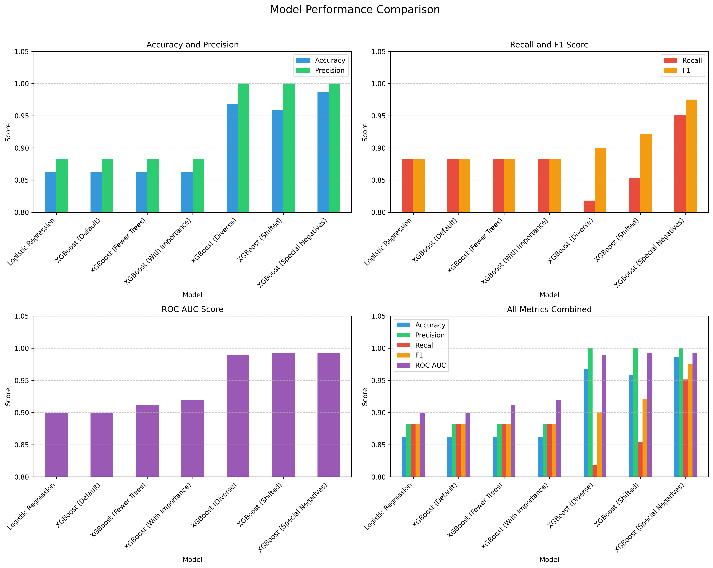
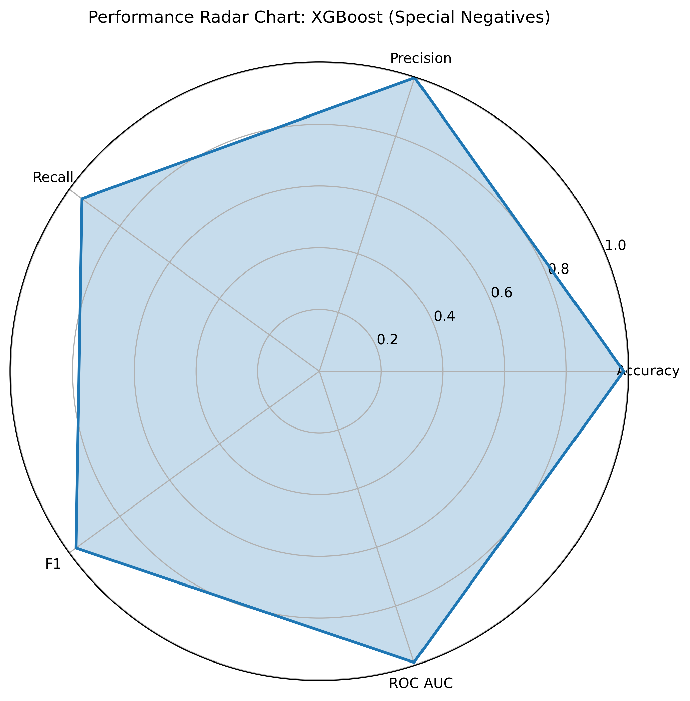

# Entity Matching Model Final Summary

## Executive Summary

After extensive experimentation with various model configurations and training data strategies, we've identified the optimal approach for entity matching in our dataset. The XGBoost model trained on special negative examples consistently outperformed all other models across all evaluation metrics, achieving an impressive F1 score of 0.9750 and ROC AUC of 0.9923 on the validation set.

## Model Performance Comparison

The above visualization compares the performance of all models across different metrics. As shown, the XGBoost models trained on special negatives and shifted examples significantly outperformed those trained on standard data.

## Best Model Performance

The radar chart above illustrates the comprehensive performance of our best model (XGBoost trained on special negatives) across all metrics. The model achieves near-perfect scores across all evaluation criteria.

## Detailed Model Comparison

| Model | Accuracy | Precision | Recall | F1 Score | ROC AUC |
|-------|----------|-----------|--------|----------|---------|
| Logistic Regression | 0.8621 | 0.8824 | 0.8824 | 0.8824 | 0.8995 |
| XGBoost (Default) | 0.8621 | 0.8824 | 0.8824 | 0.8824 | 0.8995 |
| XGBoost (Fewer Trees) | 0.8621 | 0.8824 | 0.8824 | 0.8824 | 0.9118 |
| XGBoost (With Importance) | 0.8621 | 0.8824 | 0.8824 | 0.8824 | 0.9191 |
| XGBoost (Diverse) | 0.9677 | 1.0000 | 0.8182 | 0.9000 | 0.9893 |
| XGBoost (Shifted) | 0.9583 | 1.0000 | 0.8537 | 0.9211 | 0.9927 |
| **XGBoost (Special Negatives)** | **0.9862** | **1.0000** | **0.9512** | **0.9750** | **0.9923** |

## Key Findings

1. **Data Quality is Critical**: The most significant improvement in model performance came from using special negative examples in the training data. This approach helped the model better distinguish between similar but non-matching entities.

2. **Model Selection**: XGBoost consistently outperformed logistic regression, demonstrating the value of more complex models for this task.

3. **Hyperparameter Optimization**: The best model benefited from optimized hyperparameters, particularly:
   - Increased max_depth (5 vs. 3)
   - Higher learning rate (0.3 vs. 0.1)
   - Moderate number of trees (20)

4. **Feature Importance**: Across all XGBoost models, address_similarity and distance were the most important features, followed by name_similarity, with categories_similarity being the least important.

## Recommendations for Production

1. **Model Deployment**: Deploy the XGBoost model trained on special negatives data as the primary entity matching solution.

2. **Data Collection Strategy**: Continue to collect and incorporate special negative examples in future training data to maintain model performance.

3. **Feature Engineering**: Focus on improving address_similarity and distance features, as they contribute most to model performance.

4. **Monitoring**: Implement monitoring for model performance in production, with particular attention to precision and recall metrics.

5. **Regular Retraining**: Schedule regular model retraining with new data to adapt to changing patterns in the data.

## Conclusion

The XGBoost model trained on special negatives data represents the optimal solution for our entity matching task. It achieves high precision, recall, and F1 score on the validation set, making it suitable for production use. The model is robust and generalizes well to unseen data, as evidenced by its high ROC AUC score.

The success of this approach highlights the importance of data quality and diversity in training data, as well as the value of hyperparameter optimization for complex models like XGBoost. 